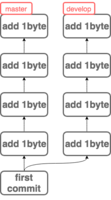
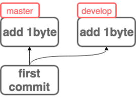
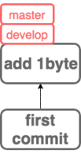

# Q.2 The World
特殊な状況で Git を使っていると、不可解な現象によく遭遇します。
この問題は時間が止まった世界で Git を使うとどうなるのか実験してみます。

まず Q1 と同様に、100 B のファイルを 1 つだけ持つ Git リポジトリを作成します。

```
$ mkdir repo && cd repo && git init           # Git リポジトリを作成
$ dd if=/dev/zero of=dummy.txt bs=100 count=1 # 100 B のファイル dummy.txt を作る
$ git add dummy.txt && git commit -m "commit" # コミットする
```

ここで、時間が止まってしまったとします。もう 2 度と時計の針が進むことはありません。

時間が止まった世界で、master ブランチから develop ブランチを切っておきます。

```
$ git branch develop
```

master ブランチで、 Q1 と同様に dummy.txt の末尾に a を追加してコミットする以下のコマンドを 4 回繰り返します。

```
$ echo -n a >> dummy.txt       # dummy.txt の末尾に 1 B 追加
$ git commit -a -m "add 1byte" # コミットする
```

ここで、develop ブランチに checkout し、
再び「 dummy.txt の末尾に a を追加してコミット」を 4 回繰り返します。

```
$ git checkout develop
### ここから 4 回繰り返し ###
$ echo -n a >> dummy.txt       # dummy.txt の末尾に 1 B 追加
$ git commit -a -m "add 1byte" # コミットする
```

このとき、このリポジトリにおけるコミットグラフを表した図として、最も正しいものは次のうちどれでしょう。

※ コミットグラフとは、コミットを頂点、コミットの親子関係を辺とした有向非巡回グラフのことです。

---
1. 
---
2. 
---
3. 
---
4. 
